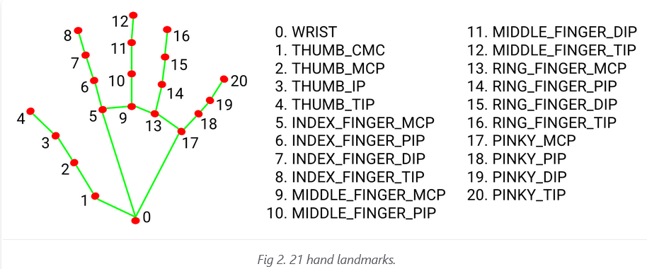
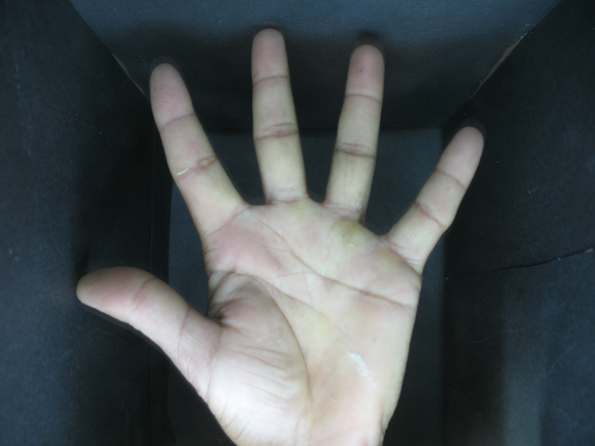
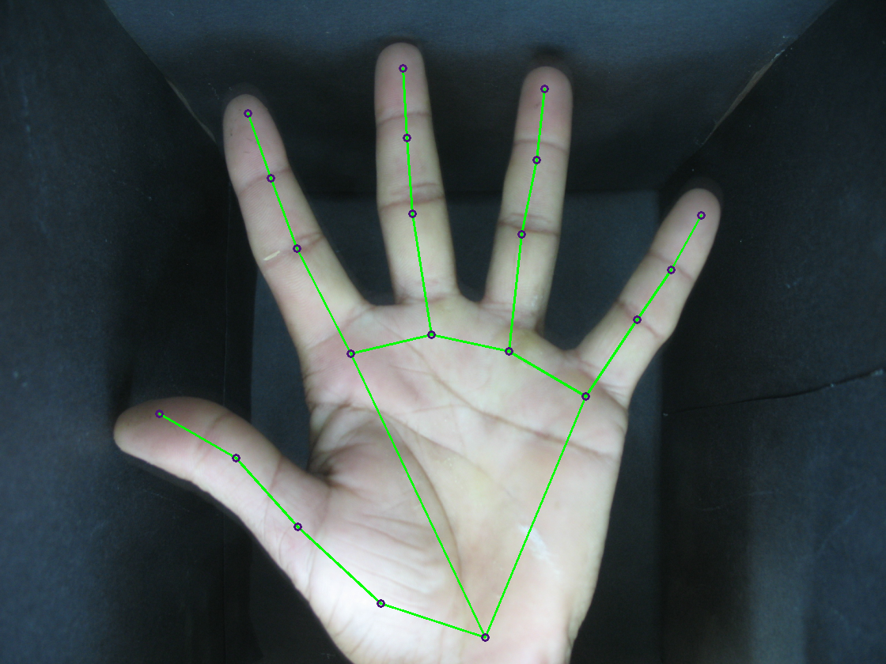
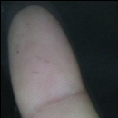
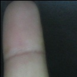
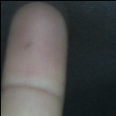
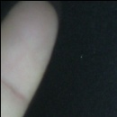
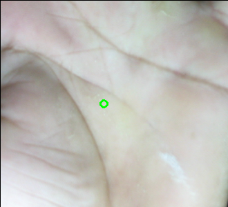
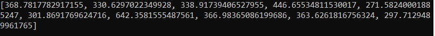

# ROI-Extraction-From-Hand-Image
#### Submitted by: Shubham Santosh Upadhyay 
#### Guided by: Asst. Prof. Rahul Chatterjee (UW Madison) 
-----------------------------------------------------------------------------------------

# Required Libraries:
1. OpenCV
2. Numpy
3. MediaPipe
-----------------------------------------------------------------------------------------

# Abstract: 
As we all know biometric authentication plays an important role in ensuring security and extraction biometric features are always a challenge. We have separate dataset available for separate biometrics but an attempt is being made to extract all three biometric i.e finger tip, Palmprint, and Hand-geometry from a single hand image. We have tried different methods and finally found the most apt solution. A significant amount of time is spent on surveying different research papers on "Authentication with the help of different biometrics" and collecting all possible datasets.

------------------------------------------------------------------------------------------
# Datasets that can be used for further research works: 

[Palmprint Dataset-Hindawi](https://staffusm-my.sharepoint.com/personal/shahrel_usm_my/_layouts/15/onedrive.aspx?id=%2Fpersonal%2Fshahrel%5Fusm%5Fmy%2FDocuments%2FResearch%5FData%2FIBGHT%5FGroundtruth&originalPath=aHR0cHM6Ly9zdGFmZnVzbS1teS5zaGFyZXBvaW50LmNvbS86ZjovZy9wZXJzb25hbC9zaGFocmVsX3VzbV9teS9FbF9kblQ5bmF1QlBwQS0yYmdWT2ZMMEJxLVNUcWg2V2k0M2M1eFZKVl9ZR2x3P3J0aW1lPXNlZ0FHUDhhMlVn)

[GPDS Dataset](https://gpds.ulpgc.es/)

[11k Hands](https://sites.google.com/view/11khands)

[IITD Dataset](https://www4.comp.polyu.edu.hk/~csajaykr/IITD/Database_Palm.htm)

[Boston University Hand Login Dataset](http://vip.bu.edu/projects/hcis/hand-login/dataset/)

[Fingerprint and Iris Databases](https://www.neurotechnology.com/download.html)

[University of Notre Dame Iris Dataset](https://cvrl.nd.edu/projects/data/)

[CASIA](http://www.cbsr.ia.ac.cn/IrisDatabase.htm)

[XM2VTSDB multi-modal face database](http://www.ee.surrey.ac.uk/CVSSP/xm2vtsdb/)

**Some sites give you datasets directly, on others you have to request.

------------------------------------------------------------------------------------------

## Methods that didn't work:
1. Skin Segmentation->Contour detection->Finding min area contour to find finger print.
2. Skin Segmentation->Finding Convex hull and Contour intersection point and finally locating ROI
3. Using deep learning (limited computational power)
4. Extracting ROIs using Haar Cascade.
 
Much detailed report i.e input output can be found in Methods_That_Didnt_Work folder.

------------------------------------------------------------------------------------------

## Method That worked:
1. Using [Mediapipe Hands](https://google.github.io/mediapipe/solutions/hands.html) opensource framework.

------------------------------------------------------------------------------------------

# Methodology:

1. MediaPipe Hands is a high-fidelity hand and finger tracking solution. It employs machine learning (ML) to infer 21 3D landmarks of a hand from just a single frame.
2. We used media pipe as it solves the problem of contour detection, skin segmentation, background removal and its dynamic.
3. The hand lamdmarks are being found and then normalized to get the cordinates of 21 points on the hand.

   
4. These cordinates are used to draw ROIs.For example- point 8,12,16 and 20 represents the index, middle, ring and pinky finger respectively. Thumb is not considered as it is tilted during photo capture.
5. Palmprint is captured by storing and finding centroid of all the palm boundary points (0,1,5,9,13,17).
6. Hand geometry includes Length of all fingers, palm width and distance between knuckles.

------------------------------------------------------------------------------------------

# Input: 
Input image 
  
------------------------------------------------------------------------------------------
 
# Output: 
 Hand Landmarks:                                 
     
 Finger Tips: 
      
 Palmprint: 
  
 Hand Geometry Values: 
  
 
 ------------------------------------------------------------------------------------------
 
 # Future Work: 
 Further more this work can be used to extract features and use it for authentication. 
 
 For finger print feature extraction from a low resolution image (The image obtained from the dataset was not meant for fingerprint and hence its a big problem to extract fingerprint features): 
 1. For preprocessing, as the pic has almost no finger print it needed to be preprocessed a lot. 
    <https://answers.opencv.org/question/6364/fingerprint-matching-in-mobile-devices-android-platform/> 
 2. For fingerprint Matching. 
    <https://github.com/Utkarsh-Deshmukh/Fingerprint-Feature-Extraction> 

 For palmprint feature extraction. 
    <https://github.com/AdrianUng/palmprint-feature-extraction-techniques> 
 
 -------------------------------------------------------------------------------------------
 # References: 
     [1]. <https://docs.google.com/spreadsheets/d/1WyfpljI49AqvCO_lV3-XOfHVg4Ilks_yJGWhZXCLU_M/edit?usp=sharing>
 
 

   

